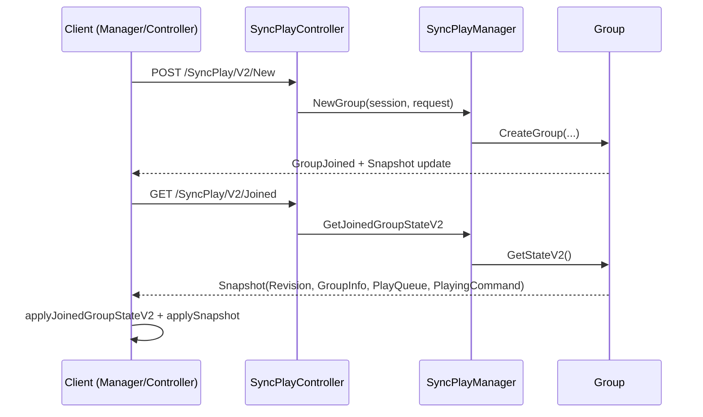
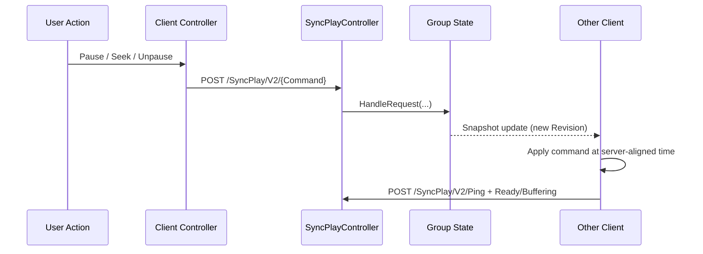

# SyncPlay V2 Developer Reference

This document is the implementation map for SyncPlay in this repository.
It is written to let a new contributor start from zero, trace the request path end-to-end, and make safe changes without breaking group sync.

## Scope

This covers:
- Client SyncPlay runtime and UI (`Client/jellyfin-web-master/src/plugins/syncPlay` and related toolbar/hooks).
- Server SyncPlay API and orchestration (`Jellyfin.Api`, `Emby.Server.Implementations/SyncPlay`, `MediaBrowser.Controller/SyncPlay`).
- SyncPlay V2 authoritative state flow (`/SyncPlay/V2/*` endpoints and snapshot/revision model).

Related index:
- `docs/syncplay/FILE_INDEX.md` for a complete path-by-path map of SyncPlay code.

This does not cover:
- General Jellyfin playback pipeline internals outside SyncPlay wrappers.
- Non-SyncPlay plugin architecture details.

## Mental Model

SyncPlay is a server-coordinated, client-executed sync system:
- The server is the source of truth for group membership, queue, state, and state revision.
- Clients execute actual media control locally and continuously reconcile with server state.
- V2 snapshot endpoints (`/SyncPlay/V2/Joined`, `/SyncPlay/V2/{id}`) are authoritative and used for recovery.

### Why V2 matters

Legacy event streams can arrive out of order. V2 protects correctness by:
- Using a monotonic server revision.
- Letting clients pull the latest snapshot when they detect stale/conflicting updates.
- Making queue + playback command reconciliation explicit.

## End-to-End Flow

## Client Architecture

### Bootstrap and top-level wiring

- `Client/jellyfin-web-master/src/plugins/syncPlay/plugin.ts`
  - Registers player wrappers.
  - Binds playback manager `playerchange` events.
  - Initializes and rebinds SyncPlay manager when active API client changes.

- `Client/jellyfin-web-master/src/plugins/syncPlay/core/index.js`
  - Constructs singleton-style SyncPlay module objects (`Manager`, `PlayerFactory`).

### Runtime coordinator

- `Client/jellyfin-web-master/src/plugins/syncPlay/core/Manager.js`
  - Central coordinator.
  - Owns: group state, reconciliation loop, pending commands, player wrapper binding.
  - Key invariants:
    - Ignore stale snapshots/updates by revision.
    - Never apply playback commands while SyncPlay is not ready.
    - Queue updates are applied before playback command execution.
  - Recovery behavior:
    - On stale queue/command signals, pulls `/SyncPlay/V2/Joined`.
    - Rehydrates membership before disabling SyncPlay.

### Control and playback execution

- `Client/jellyfin-web-master/src/plugins/syncPlay/core/Controller.js`
  - User-originated actions (pause/unpause/seek/queue/etc.).
  - Applies command cooldown and optional ready-gate before unpause.

- `Client/jellyfin-web-master/src/plugins/syncPlay/core/PlaybackCore.js`
  - Schedules and executes group playback commands locally.
  - Handles sync correction (`SpeedToSync` / `SkipToSync`) and late command handling.
  - Reports buffering/ready state back to server.

- `Client/jellyfin-web-master/src/plugins/syncPlay/core/QueueCore.js`
  - Applies server queue updates and triggers local playback entry points.
  - Rejects old queue updates and forces authoritative recovery.

### Time sync

- `Client/jellyfin-web-master/src/plugins/syncPlay/core/timeSync/TimeSync.js`
  - Generic offset/ping estimation.
- `Client/jellyfin-web-master/src/plugins/syncPlay/core/timeSync/TimeSyncServer.js`
  - Uses `/GetUTCTime` to estimate RTT/offset.
- `Client/jellyfin-web-master/src/plugins/syncPlay/core/timeSync/TimeSyncCore.js`
  - Bridges manager to time sync source and settings (`extraTimeOffset`).

### Transport helpers and utils

- `Client/jellyfin-web-master/src/plugins/syncPlay/core/V2Api.js`
  - All client-side SyncPlay writes target `/SyncPlay/V2/*`.
- `Client/jellyfin-web-master/src/plugins/syncPlay/core/Helper.js`
  - Event waiting, playback item translation, playback query helpers.
- `Client/jellyfin-web-master/src/plugins/syncPlay/core/Settings.js`
  - Namespaced settings read/write (`syncPlay` prefix).

### UI surfaces

- `Client/jellyfin-web-master/src/apps/experimental/components/AppToolbar/SyncPlayButton.tsx`
  - Toolbar visibility/access gate and menu anchor.
- `Client/jellyfin-web-master/src/apps/experimental/components/AppToolbar/menus/SyncPlayMenu.tsx`
  - Group create/join/leave/start-stop/settings actions.
  - Group list polling while menu is open and not currently joined.
- `Client/jellyfin-web-master/src/hooks/useSyncPlayGroups.ts`
  - React-query wrapper for `/SyncPlay/V2/List`.
- `Client/jellyfin-web-master/src/plugins/syncPlay/ui/settings/SettingsEditor.js`
  - SyncPlay settings editor and profile system.
- `Client/jellyfin-web-master/src/plugins/syncPlay/ui/settings/editor.html`
  - Settings form template.

### Player wrappers

- `Client/jellyfin-web-master/src/plugins/syncPlay/core/players/PlayerFactory.js`
- `Client/jellyfin-web-master/src/plugins/syncPlay/core/players/GenericPlayer.js`
- `Client/jellyfin-web-master/src/plugins/syncPlay/ui/players/NoActivePlayer.js`
- `Client/jellyfin-web-master/src/plugins/syncPlay/ui/players/HtmlVideoPlayer.js`
- `Client/jellyfin-web-master/src/plugins/syncPlay/ui/players/HtmlAudioPlayer.js`
- `Client/jellyfin-web-master/src/plugins/syncPlay/ui/players/QueueManager.js`

These adapters isolate SyncPlay runtime logic from concrete media player APIs.

## Server Architecture

### API boundary

- `Jellyfin.Api/Controllers/SyncPlayController.cs`
  - REST surface for all SyncPlay requests.
  - V2 routes are first-class and coexist with legacy aliases.
  - Route categories:
    - Membership: `New`, `Join`, `Leave`, `List`, `V2/Joined`, `V2/{id}`
    - Queue/transport: `SetNewQueue`, `Queue`, `Pause`, `Unpause`, `Seek`, etc.
    - Sync signals: `Ready`, `Buffering`, `Ping`, `SetIgnoreWait`

### Session/group orchestration

- `Emby.Server.Implementations/SyncPlay/SyncPlayManager.cs`
  - Owns:
    - Group registry.
    - Session-to-group mapping.
    - Active session counters.
  - Concurrency rule:
    - `_groupsLock` guards cross-group state and mapping mutation.
    - Group instance lock guards per-group mutable state.
    - Lock ordering must remain `_groupsLock` -> `group lock`.

- `Emby.Server.Implementations/SyncPlay/Group.cs`
  - Per-group state machine context.
  - Owns participants, queue manager, position, revision, and current group state implementation.
  - Emits group updates and snapshots.
  - `Revision` is incremented on state-changing operations and used by V2 snapshots.

### Domain state machine and requests

- `MediaBrowser.Controller/SyncPlay/GroupStates/*`
  - Idle / Waiting / Playing / Paused behaviors.
- `MediaBrowser.Controller/SyncPlay/PlaybackRequests/*`
  - Typed request handlers (Pause, Seek, Queue, Ping, Ready, etc.).
- `MediaBrowser.Controller/SyncPlay/Queue/PlayQueueManager.cs`
  - Queue mutation and playback index maintenance.

## State and Revision Invariants

When changing SyncPlay behavior, keep these invariants:
- Server revision must increase on any mutation that clients must reconcile.
- Client must not apply stale snapshot/queue updates (`incomingRevision < latestRevision`).
- Client should prefer authoritative pull (`/V2/Joined`) on inconsistency, not local guessing.
- Queue update side effects must be deterministic and idempotent for duplicate events.
- Ready/buffering signals must include the same queue/playback identity expected by server.

## Settings Reference (Client)

Primary keys under `syncPlay.*`:
- `syncProfile`
- `enableSyncCorrection`
- `enforceReadyBeforeUnpause`
- `commandCooldownMs`
- `bufferingThresholdMillis`
- `useSpeedToSync`
- `useSkipToSync`
- `minDelaySpeedToSync`
- `maxDelaySpeedToSync`
- `speedToSyncDuration`
- `minDelaySkipToSync`
- `maxLateCommandMillis`
- `maxLateSeekRecoveryMillis`
- `seekReadySettleDelayMs`
- `maxSeekSettleDiffMillis`
- `seekReadyEventTimeoutMs`
- `zeroSeekAnchorMillis`
- `extraTimeOffset`

## Where to start for common changes

- Add/adjust transport behavior:
  - `Controller.js` + `PlaybackCore.js` + `SyncPlayController.cs` request route.
- Add new server authoritative state field:
  - `Group.cs` snapshot model -> API DTO -> client `Manager.applySnapshot`.
- Adjust queue transitions:
  - `PlayQueueManager.cs` + `QueueCore.js`.
- Tune latency/desync behavior:
  - `TimeSync*` + `PlaybackCore` thresholds + settings editor.

## Test checklist

- Create/join/leave group from two browser sessions.
- Start playback from idle and verify both enter ready/wait/playing transitions.
- Pause/unpause spam test with cooldown.
- Multiple seeks including near `0:00` and during transcode.
- One direct-play + one transcode participant seek convergence.
- Group recovery:
  - close/reopen tab.
  - disconnect/reconnect websocket.
  - stale queue update scenario -> verify `/V2/Joined` recovery.
- Confirm no stale revision applies in logs.
